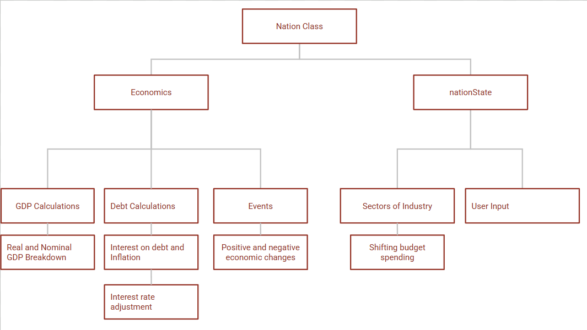

# Technical Details:

Period: 4

Member Names: Seth Fenton, Jai Shah

Group Name: It's The Economy Stupid

Brief Description: 

An economics simulator where the player will be able to manage the fiscal and monetary policies of a government operating within a real world national economy. This simulator will include interest rates, a full government budget accounting for most major sectors and the capacity to modify all of these things to produce a stronger economy. 
It will also hopefully include international trade, a human development index modifier and the happiness of the people in utils.

A description of your technical design. This should include: 

Minimum Viable Product: 

1. A domestic economy simulator with a collective of playable nations (likely including America, Germany, China and Japan) editable interest rates, government budgets in atleast four sectors (eg. manufacturing, healthcare, salaries, millitary)
2. Calculations of critical economic indicators including Real GDP, Real GDP Per Capita, Nominal GDP, Nominal GDP per capita, inflation rate, Government debt
3. Changing ease of economic growth depending upon global conditons generated by a combination of random and fixed events (year dependent)
4. Time progression incremented by month
5. Command line input taken from the player

How you will be using the topics covered in class in the project

1. We'll use a nation class that will contain functions to calculate our major economic indicators (will function as our major parent class) (this will provide us the capacity to add more nation states in for a dynamic trade system and go beyond our minimum viable product)
2. We'll use sorting to derive a dynamic list of top ten nations by GDP (initially this will just include your nation of it makes it, plus the other nations real world GDPs but we hope to change that after minimum viable product is achieved)
3. We'll initially use the command line to take player input using the method we learned in class though we'll later modify that to use widgets with will interact with processing once we achieve minimum viable product

# Project Design

UML Diagrams and descriptions of key algorithms, classes, and how things fit together.

Instance Variables: 
Doubles: Consumer Spending, Investment: Government Spending, Exports (leave default for now), Imports (leave default for now), DefaultGDPGrowthRate

Static Doubles: Global Economic Goodness Modifier (GEGM), Global GDP Growth, Global GDP

GDP Calculations: 
Sum Of Instance Variables: Consumer Spending + Investment + Government Spending + Net Exports default (modified when trade features are added)

Debt Calculations: 
Interest Rate Adjustments: 
Adjusts interest rate which modifies gdp growth rate 
Events: Runs through an ArrayList of Events and triggers one 
Budget Expenditure: the set of methods that governs government spending
User Input Actions: found within the running class, scans for user input
    
# Intended pacing:

How you are breaking down the project and who is responsible for which parts.

5/26/2025

Full Nation Class With All Indicator Methods Complete and Reigons Specified- Seth and Jai

Early stage government budget control interface - Seth

Early stage interest rate control interface and inflation modification - Jai

5/28/2025
First nation built out with hardcoded initial instance variables (probably Germany to more efficently test Eurozone events later on) - Jai

Counter of top ten global economies included somewhere on screen - Seth

5/30/2025

Rigorous testing of all prior completed functions and game progression to make sure they work - Seth and Jai

First short term positive and negative events - Jai

Global Economic Conditions modifier added in early stage for later testing - Seth

6/1/2025

All major domestic economic levers testing, and easy player interfacing and reading via terminal, minimum viable product complete - Seth and Jai

6/4/2025

Important trade indicators added to nation class (including net exports being added to GDP calculations where before it was just stuck at its initial value) and top ten trade partner list of nations successfully implemented as instance variable- Seth

Top ten trade partner economic growth successfully stored and applied - Jai

6/6/2025 

Global events properly apply to trade partners and balence of trade changes with trade partner growth - Jai

GPT API integration to successfully look up trade partners and their respective statistics so it doesn't have to have numbers hardcoded in - Seth

6/12/2025 
Gui programming complete, widgets and buttons control major functionalities - Seth and Jai

6/14/2025 
All features tested project is complete -  Seth and Jai

